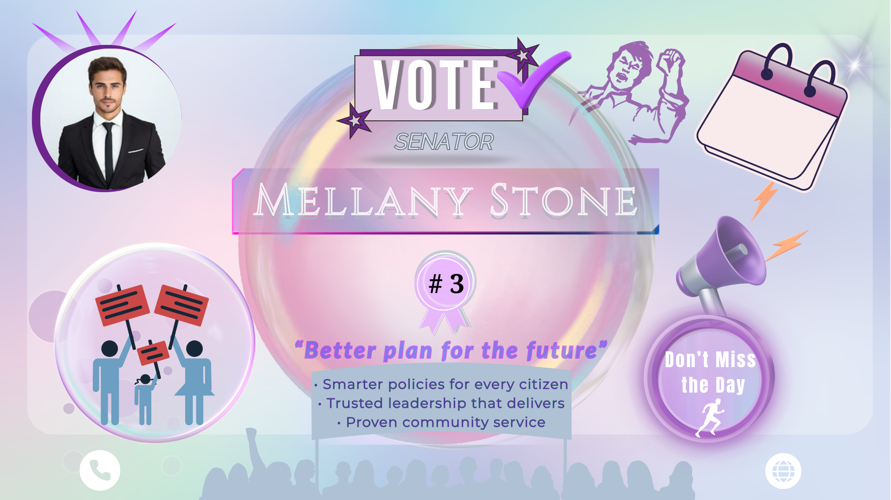
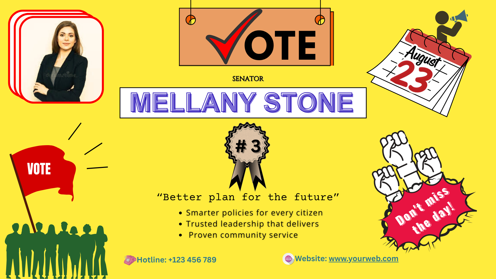

# 🎨 Rajashree Radhakrishnan – Creative Design Showcase

Welcome to my design gallery and submission portfolio.  
This repository features original works created using **Canva**, showcasing modern design trends such as **Glassmorphism**, **Neo-Brutalism**, **Logos**, and **Personal Branding**.

---

## 🖼️ Design Gallery

Explore a collection of logos and posters that reflect clarity, creativity, and impactful visual storytelling.

### 🔹 Logo Designs

  
  

---

### 🔹 Informative Posters

  
  
  
  

---

### 🔹 Personal Branding Logos

  
  

These two logos represent my identity as an aspiring AI and Web Developer:

- **My Brand Logo:** Features the letter “R” on a screen with a brain — symbolizing AI, learning, and coding.
- **Portfolio Logo:** Brain-shaped bulb paired with my name — a visual of creativity, smart work, and innovation.

---

## 🎯 Featured Theme-Based Posters

These designs were created for a design challenge to reflect trending UI aesthetics.

### 🧊 Glassmorphism Poster

A soft, glowing design using transparent blur layers and depth to bring elegance and clarity.

---

### 🧱 Neo-Brutalism Poster

A bold, structured layout using flat colors and sharp typography to convey strength and honesty.

---

## 📁 File Summary

| File Name             | Style           | Format | Description                           |
|----------------------|-----------------|--------|---------------------------------------|
| `Glassmorphism.png`   | Glassmorphism    | PNG    | Elegant poster with blur and glow     |
| `Neo-brutalism.png`   | Neo-Brutalism    | PNG    | Bold layout with flat and raw visuals |

---

## 🛠️ Tools & Skills Used

- **Design Tool:** Canva  
- **Core Concepts:** Layout planning, visual hierarchy, style referencing  
- **Trends Practiced:** Glassmorphism, Neo-Brutalism, Branding  
- **Skills Applied:** Typography, color balance, composition, content clarity

---

## 👩‍💻 About Me

**Rajashree Radhakrishnan**  
I'm a passionate designer and developer who loves blending **aesthetic creativity** with **technical thinking**. I aim to create designs that are simple, smart, and purposeful.

- 🎓 BCA Graduate, exploring AI and Frontend Development  
- ✨ Created 10+ visual projects for brand identity and communication  
- 🌱 Currently growing in UI/UX, web development, and data storytelling

---

## 📬 Let’s Connect

- 📧 Email: [rajashree.careerpath@gmail.com](mailto:rajashree.careerpath@gmail.com)  
- 🐙 GitHub: [itsrajashree](https://github.com/itsrajashree)  
- 🌐 Portfolio: coming soon

---

> ✨ Thank you for visiting. I'm excited to keep creating, growing, and contributing meaningfully in the world of digital design.
