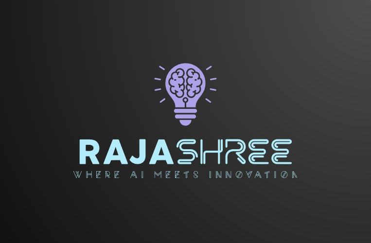
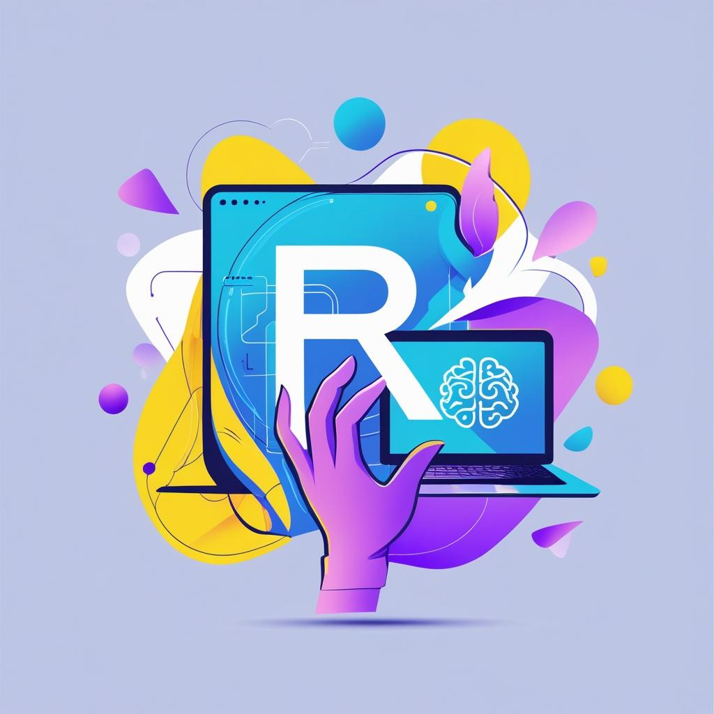

# Design-gallery
<h2>🎨 Design Gallery</h2>

Explore my Canva creations — logos and posters designed with creativity and clarity.

<h3>🔹 Logos</h3>

<h3>🔹 Posters</h3>

<h4>🧠 Personal Branding Logos</h4>

These two logos are part of my personal brand as an aspiring AI and Web Developer:

<ul>
  <li><strong>My Brand Logo:</strong> Features the letter "R" with a brain on a screen — representing AI, learning, and programming using tools like Python and TensorFlow.</li>
  <li><strong>Portfolio Logo:</strong> Shows my full name with a brain-shaped bulb and slogan — symbolizing creativity, smart solutions, and my mission as a digital creator.</li>
</ul>

🚀 These visuals are used across GitHub, Fiverr, and my future portfolio to reflect my identity and growth mindset.

